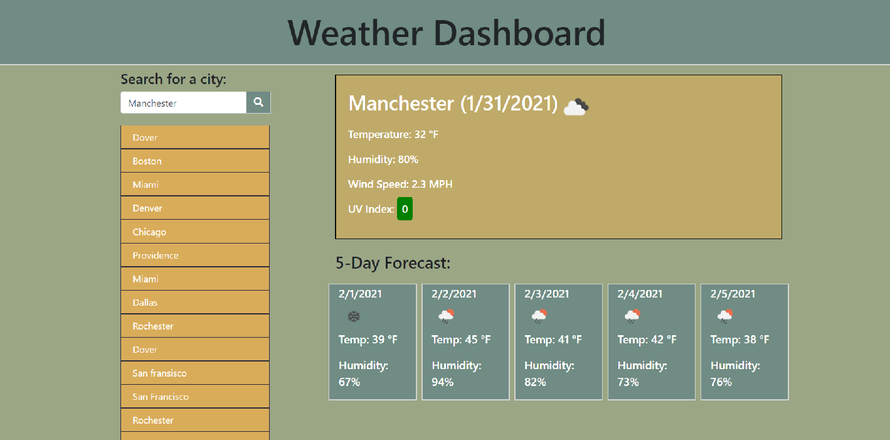
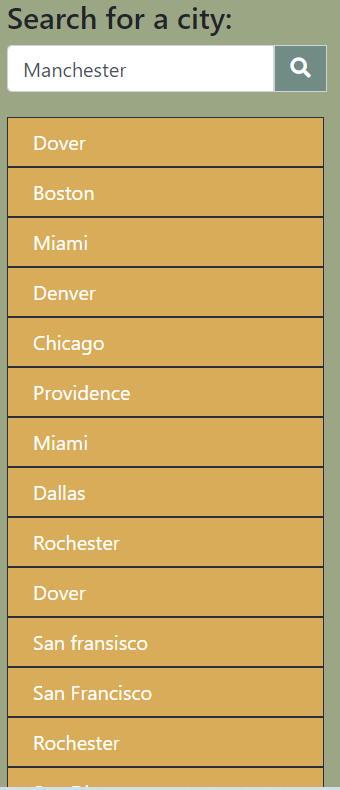
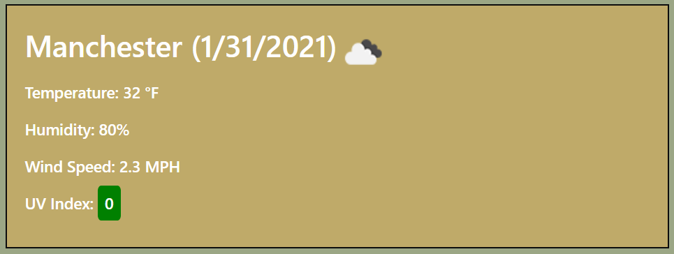
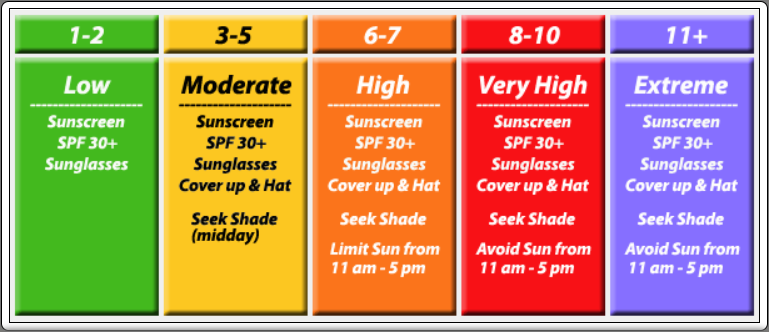
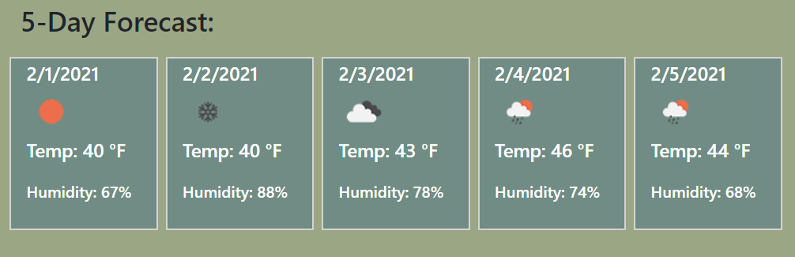
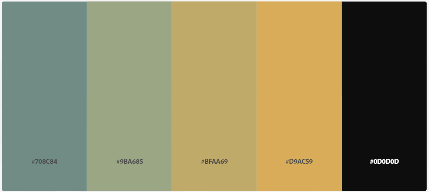

# Weather Dashboard

## Description

This site displays the weather for the city entered by user.  The user is presented with the current weather as well as the five day forecast.  All cities searched for are saved in history. 

&nbsp;

[Link to GitHub repository](https://github.com/Heath-Bennett/weatherDashboard)

[Link to deployed page](https://heath-bennett.github.io/weatherDashboard/)

&nbsp;

## Table of Contents

&nbsp;

* [Image of Index.html](#Image-of-Index.html)
* [Search and History](#Search-and-History)
* [Current Weather](#Current-Weather)
* [UV Index](#UV-Index)
* [Five Day Forecast](#Five-Day-Forecast)
* [Colors Used](#Colors-Used)
* [Resources Used](#Resources-Used)
* [Collaborators](#Collaborators)
* [How I Would Like to Improve the Project](#How-I-Would-Like-to-Improve-the-Project)
* [License](License)

&nbsp;

## Image of Index.html

&nbsp;

[Table of Contents](#Table-of-Contents)

&nbsp;

## Search and History

The user enters the city into the text box and clicks the button with the magnifying glass.  This causes the city to be save to history.  Then the current weather and five day forecast is displayed for the city.  The user is able to click any of the cities in history and the current weather and five day forecast will be displayed.  Upon page load the last city entered into the text box is displayed. 

&nbsp;

[Table of Contents](#Table-of-Contents)

&nbsp;

## Current Weather

The current weather displays the city searched for, the date, icon representation of the weather, Temperature, Humidity, Wind Speed and UV index are displayed. 

&nbsp;

[Table of Contents](#Table-of-Contents)

&nbsp;

## UV Index

The UV rating is displayed using the Global Solar UV Index. A rating of 1-2 is low, 3-5 is moderate, 6-7 is high, 8-10 is very high, 11+ is extreme.  These are colored with low being green, moderate is yellow, high is orange, very high is red, and extreme is purple.

&nbsp;

[Table of Contents](#Table-of-Contents)

&nbsp;

This chart was retrieved from:

[Foresthillweather.com](http://www.foresthillweather.com/UV-forecast.php)

&nbsp;

## Five Day Forecast

The Five Day Forecast displays the date, an icon representation of the day's weather, temperature, and humidity.

&nbsp;

[Table of Contents](#Table-of-Contents)

&nbsp;

## Colors Used

The colors were chosen using [Adobe Color](color.adobe.com) 

[Table of Contents](#Table-of-Contents)

&nbsp;

## Resources Used
&nbsp;

[Bootstrap](https://getbootstrap.com/)

[Font Awesome](https://fontawesome.com/)

[Luxon](https://moment.github.io/luxon/)

[Table of Contents](#Table-of-Contents)

&nbsp;

## Collaborators

Thank you Tristan LaRoche for helping me straighten out my issues with search history!

[Table of Contents](#Table-of-Contents)

&nbsp;

## How I would like to improve the project

I would like to add a Dynamic background image and themed colors that change according to what the current weather is.   

I would also like to find a better API to use this one does not give accurate coordinates even if you were to search by city and state.  I have found it only works for major cities. 

[Table of Contents](#Table-of-Contents)

&nbsp;

## License

MIT License

Copyright (c) [2021] [Heath Bennett]

Permission is hereby granted, free of charge, to any person obtaining a copy
of this software and associated documentation files (the "Software"), to deal
in the Software without restriction, including without limitation the rights
to use, copy, modify, merge, publish, distribute, sublicense, and/or sell
copies of the Software, and to permit persons to whom the Software is
furnished to do so, subject to the following conditions:

The above copyright notice and this permission notice shall be included in all
copies or substantial portions of the Software.

THE SOFTWARE IS PROVIDED "AS IS", WITHOUT WARRANTY OF ANY KIND, EXPRESS OR
IMPLIED, INCLUDING BUT NOT LIMITED TO THE WARRANTIES OF MERCHANTABILITY,
FITNESS FOR A PARTICULAR PURPOSE AND NONINFRINGEMENT. IN NO EVENT SHALL THE
AUTHORS OR COPYRIGHT HOLDERS BE LIABLE FOR ANY CLAIM, DAMAGES OR OTHER
LIABILITY, WHETHER IN AN ACTION OF CONTRACT, TORT OR OTHERWISE, ARISING FROM,
OUT OF OR IN CONNECTION WITH THE SOFTWARE OR THE USE OR OTHER DEALINGS IN THE
SOFTWARE.

[Table of Contents](#Table-of-Contents)